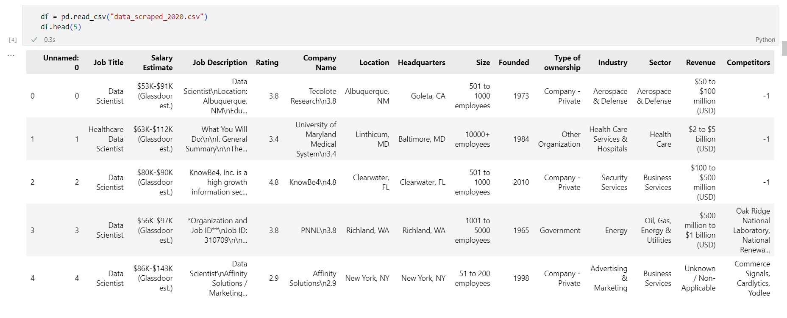
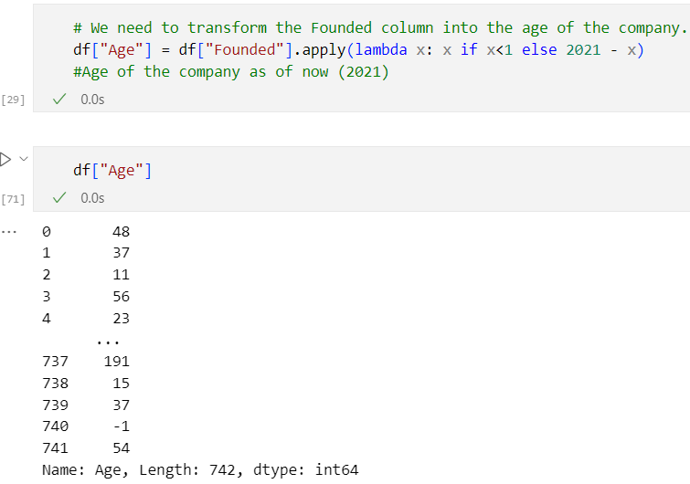
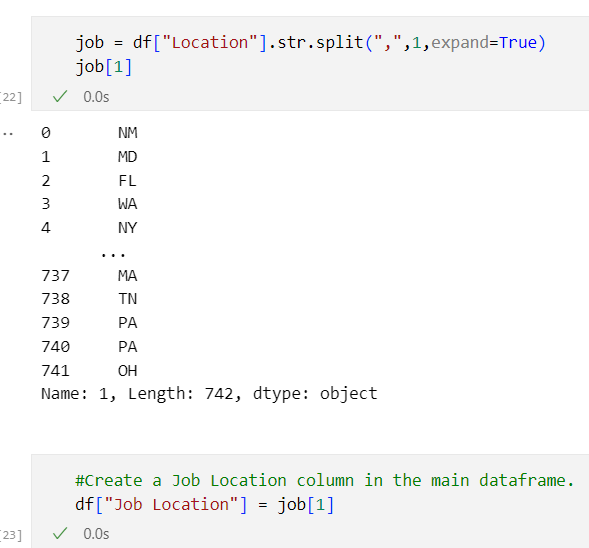
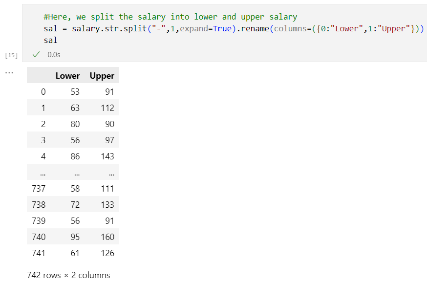
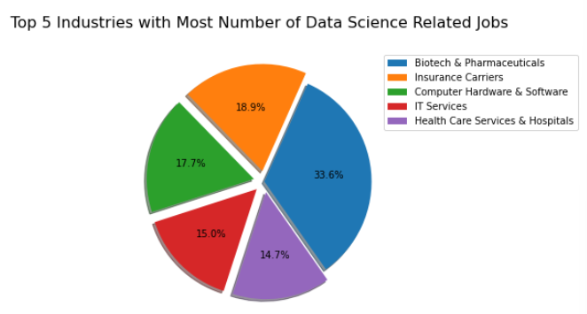
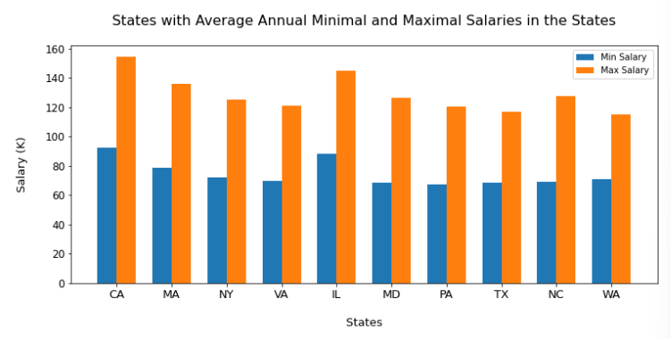
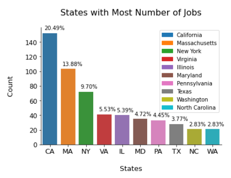
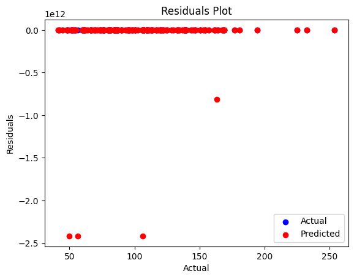
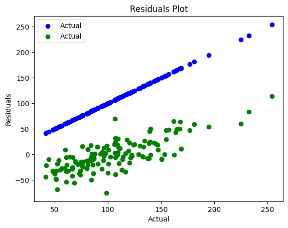
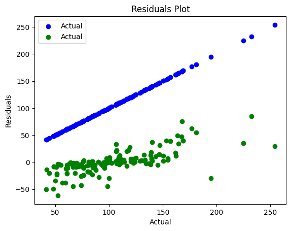

# `Employment Analytics: DataScience Jobs`

# AT84.02: Business Intelligence and Analytics

### Dataset Source:
    https://www.kaggle.com/datasets/andrewmvd/data-scientist-jobs

## Technologies Used
* Python 
* Tableau
* Keras
* Scikit Learn
* Tab py
* Anaconda Navigator 

## Dataset Sample

Here, is the dataset sample before preprocessing. Fig: Scraped raw data from Glassdoor

## Preprocessing on Dataset:
* Basic Cleanings:
    * Drop duplicate data and fill NaN values where possible
    * Remove false index column and rows with no salary mentioned
    * Reset the index
* Parsed numeric data out of salary column as min, max and avg_salary:
* Parsed rating out of company text and removed undesired characters:
* Made new column for company state
* Extracted age of company from founded data
* Created separate columns for different skills mentioned in the job description:
    * Python, Spark, AWS, Excel, SQL, SAS, Julia, Keras, MatPlotLib, PyTorch, etc. 
* Created a simplified Job Title column
* Created column for Seniority using Job title and job description info
* Cleaned other columns
* Created a Degree column through info extracted from job description column

## Some of the snapshot of preprocessing

## Key Focus Areas

* Prediction of salary based on job-seeker requirements
* Valuable insights regarding company size, scale, salaries
* Necessary factors for considering a workplace or job for data scientists or data analysts.

## Dataset information:

|No.|	Column Name |	Description|
|---|  ---     |-----|
|1|	Job Title|	The title of job, e.g., Data Scientist, junior data scientist, etc.|
|2|	Salary |Estimate	Range of salary and the source|
|3|	Job Description	|Tells us what is expected out of the job title|
|4| Rating	|Rating of the company|
|5| Company Name|	Name of the company|
|6|	Location|	Job location with city and US state information|
|7	|Headquarters	|Location of headquarters of the company|
|8	|Size|	Range of the number of employees working in the company|
|9	|Founded	Year| the company was founded in|
|10	|Type Of Ownership|	Company is private, public, or government-owned|
|11	|Industry|	Industry of the company|
|13	|Revenue	|Total revenue of the company per year|
|14	|Degree	Experience| credit for master (M) or Ph.D degree (P)|
|15	|min_salary|	Lower salary reported for the job in a particular company|
|16	|max_salary	|Upper salary reported for the job in a particular company|
|17	|avg_salary(K)	|Avg salary reported for the job in a particular company in thousands of dollars|
|18	|job_state|	US State in which the company is located|
|19	|Skills|	Multiple columns of skills with 1 indicating required and 0 indicating not required|
|20	|Jobtitle_sim|	Simplified Job title|
|21|	Seniority|	Seniority of position - Senior or Junior|
|22|	Country	|Country where job is posted (all US data)|

## Exploratory Data Analysis (EDA):

## Tableau Dashboard Design (Homepage):

## Descriptive Dashboard (Job Seeker Dashboard)

## Important Features Dashboard

## Salary prediction dashboard
We utilize four models for salary prediction: Lasso Multinomial Linear Regression, Random Forest, Linear Regression, and Artificial Neural Network (ANN). In the dashboard, data scientist skills such as Excel, SQL, Hadoop, and BI are merged with necessary characteristics such as job location, size, industry, sector, type of ownership, etc. that were retrieved from preprocessing for estimating compensation through the three models previously described.

### Model :
* Linear Regression
* Lasso Regression
* Random Forest Regression
* Artifical Neural Network (KerasRegressor)

#### Best parameter:

|Random Forest: | criterion: friedman_mse| max_features: sqrt |n_estimators: 50
|-----| -------|------|----|
|KerasRegressor:| activation: relu ,batch_size: 64| epochs: 1000, dropout_rate: 0.2| neurons: 128, optimizer: adam|

#### Best Performance:

|Model Name|MAE|MSE|R2|
|---|---|---|---|
|Linear Regression |54120493236.73|1.2203 x 10^23|-7.7803 x 10^19|
|Lasso Regression|23.575|924.71|0.41|
|Random Forest|14.8165|487.44|0.69|
|KerasRegressor (ANN)|14.124|534.19|0.66|

#### Model Analysis:
* Linear Regression:
We have plotted 2 graphs namely actual vs predicted and actual vs residual plot for analysis. In the predicted vs actual graph, the x-axis represents the actual values of the target variable (what we are trying to predict), while the y-axis represents the predicted values of the target variable obtained from the mode.

Each point in the graph represents an instance in the test data set. A perfect model would have all the points lying on a 45-degree line, indicating that the predicted values match the actual values. However, in reality, the predicted values will deviate from the actual values, resulting in a scatter plot. The degree of deviation from the 45-degree line gives us an idea about the accuracy of the model.
In the actual vs residual graph, the x-axis represents the actual values of the target variable, while the y-axis represents the difference between the predicted and actual values, known as the residual. 

Each point in the graph represents an instance in the test data set. A perfect model would have all the points lying on the x-axis, indicating that the predicted values match the actual values perfectly. However, in reality, the predicted values will deviate from the actual values, resulting in a scatter plot. The degree of deviation from the x-axis gives us an idea about the variability of the residuals, which in turn gives us an idea about the accuracy of the model. The goal is to have the residuals spread evenly around zero, with no particular pattern or trend, indicating that the model is making unbiased predictions.

* Lasso Regression:
For the predicted vs. actual plot in Lasso Regression, the model seems to be performing moderately well, as the predicted values are generally close to the actual values. However, there are still some points that are quite far from the regression line, suggesting that the model may not be capturing all the variability in the data.

For the predicted vs. residual plot in Lasso Regression, we want to see a relatively random distribution of points around the horizontal line at zero. In this case, the plot shows a somewhat random distribution of points, but there does appear to be a slight pattern of increasing residual values as the predicted values 

This could suggest that the model is not capturing some important non-linear relationships in the data. However, the overall pattern is relatively small, indicating that the model is still reasonably well-fit to the data.

* Random Forest Regression:

The predicted vs actual plot for Random Forest regression shows how well the model predicts the target variable compared to the actual values. Ideally, the predicted values should be close to the actual values, resulting in a diagonal line. The closer the data points are to this line, the better the model performs. In this case, we can see that the model predicts the target variable quite well, as the data points are close to the diagonal line.

The predicted vs residual plot shows the relationship between the predicted values and the errors made by the model. The errors are the difference between the predicted values and the actual values. Ideally, the data points should be scattered randomly around the horizontal line at 0, indicating that the errors are distributed evenly and do not show any clear patterns. In this plot, we can see that the errors are randomly distributed around 0, indicating that the model is not biased towards any specific range of predicted values. This suggests that the model is a good fit for the data and the errors are not systematically affecting the predictions.

* Artifical Neural Network (KerasRsgression):
The "predicted vs actual" plot shows the relationship between the actual target values (i.e., the real values) and the predicted target values (i.e., the values predicted by the model). The plot consists of a scatter plot where the x-axis represents the actual values and the y-axis represents the predicted values. 

The ideal scenario is when all the points lie on a 45-degree diagonal line, which indicates that the model has predicted the target values perfectly. In your case, the points are relatively close to the diagonal line, which indicates that the model is doing a decent job in predicting the target values.
The "predicted vs residual" plot shows the relationship between the predicted target values and the residuals. The residual is the difference between the actual target value and the predicted target value. The plot consists of a scatter plot where the x-axis represents the predicted values and the y-axis represents the residuals. 

### Conclusion:
From the implementation of the dashboard as well as the models inside, we mainly developed using TabPy with some connection with the Python script. We also use some instant libraries packed in TabPy such as Numpy, Pandas, and Sci-Kit
Learning. In our models, we created 4 models which are: Linear Regression, Lasso Regression, Artificial Neural Network and Random Forest regression. We found the difference of the performance between models, the Random Forest Regressor gave us the most effective result on prediction and Linear Regression the worst among 4 models. We learnt a lot through the analysis of this dataset. We learnt to analyze the data as well as cleanly preprocess it according to our needs. We performed exploratory data analysis to understand the data and pick important features through feature importance.
We developed our skills in Tableau, TabPy and Python while learning new things like python integration within Tableau to create interactive dashboards with live updates to data. Overall, we learnt many skills through this project and improved our business intelligence skills as well as analytical skills.

