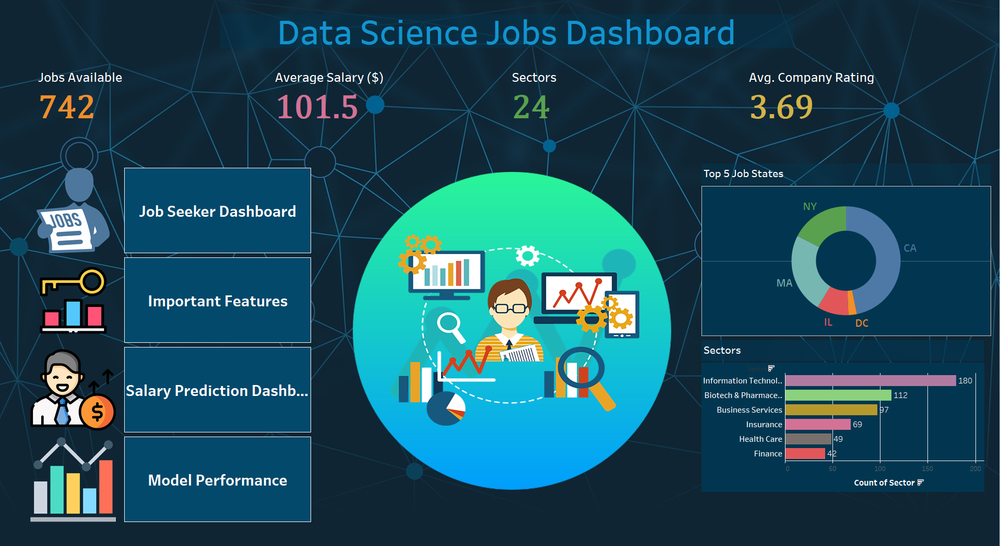
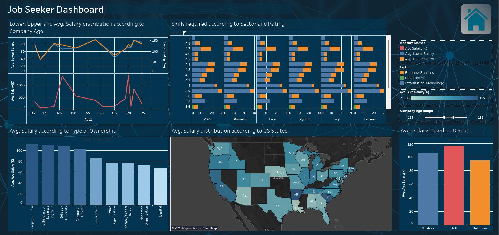
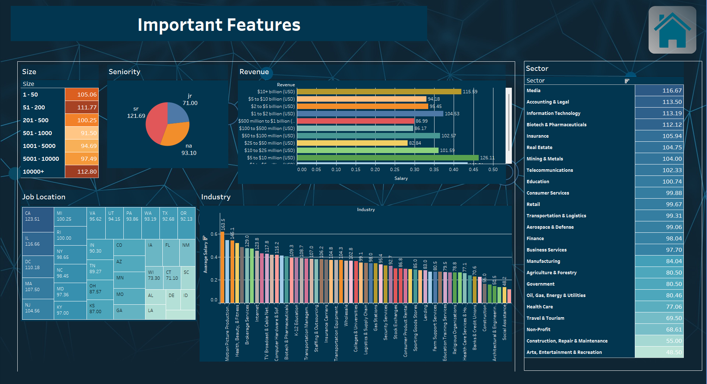
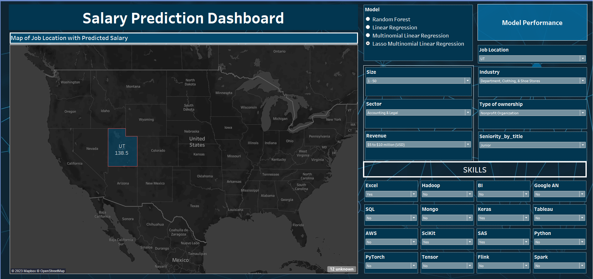

# `Employment Analytics: DataScience Jobs`

#AT84.02: Business Intelligence and Analytics

### Dataset Source:
    https://www.kaggle.com/datasets/andrewmvd/data-scientist-jobs

## Technologies Used
* Python 
* Tableau
* Keras
* Scikit Learn
* Tab py

## Dataset Sample

## Preprocessing on Dataset:
* Basic Cleanings:
    * Drop duplicate data and fill NaN values where possible
    * Remove false index column and rows with no salary mentioned
    * Reset the index
* Parsed numeric data out of salary column as min, max and avg_salary:
* Parsed rating out of company text and removed undesired characters:
* Made new column for company state
* Extracted age of company from founded data
* Created separate columns for different skills mentioned in the job description:
    * Python, Spark, AWS, Excel, SQL, SAS, Julia, Keras, MatPlotLib, PyTorch, etc. 
* Created a simplified Job Title column
* Created column for Seniority using Job title and job description info
* Cleaned other columns
* Created a Degree column through info extracted from job description column

## Some of the snapshot of preprocessing

## Key Focus Areas

* Prediction of salary based on job-seeker requirements
* Valuable insights regarding company size, scale, salaries
* Necessary factors for considering a workplace or job for data scientists or data analysts.

## Dataset information:

|No.|	Column |Name |	Description|
|---|  ---     |----|-----|
|1|	Job Title|	The title of job, e.g., Data Scientist, junior data scientist, etc.|
|2|	Salary |Estimate	Range of salary and the source|
|3|	Job Description	|Tells us what is expected out of the job title|
|4| Rating	|Rating of the company|
|5| Company Name|	Name of the company|
|6|	Location|	Job location with city and US state information|
|7	|Headquarters	|Location of headquarters of the company|
|8	|Size|	Range of the number of employees working in the company|
|9	|Founded	Year| the company was founded in|
|10	|Type Of Ownership|	Company is private, public, or government-owned|
|11	|Industry|	Industry of the company|
|13	||Revenue	|Total revenue of the company per year|
|14	|Degree	Experience| credit for master (M) or Ph.D degree (P)|
|15	|min_salary|	Lower salary reported for the job in a particular company|
|16	|max_salary	|Upper salary reported for the job in a particular company|
|17	|avg_salary(K)	|Avg salary reported for the job in a particular company in thousands of dollars|
|18	|job_state|	US State in which the company is located|
|19	|Skills|	Multiple columns of skills with 1 indicating required and 0 indicating not required|
|20	|Jobtitle_sim|	Simplified Job title|
|21|	Seniority|	Seniority of position - Senior or Junior|
|22|	Country	|Country where job is posted (all US data)|

## Exploratory Data Analysis (EDA):

## Tableau Dashboard Design (Homepage):

## Descriptive Dashboard (Job Seeker Dashboard)

## Important Features Dashboard

## Salary prediction dashboard
 
    We utilize four models for salary prediction: Lasso Multinomial Linear Regression, Random Forest, Linear Regression, and Artificial Neural Network (ANN). In the dashboard, data scientist skills such as Excel, SQL, Hadoop, and BI are merged with necessary characteristics such as job location, size, industry, sector, type of ownership, etc. that were retrieved from preprocessing for estimating compensation through the three models previously described.

